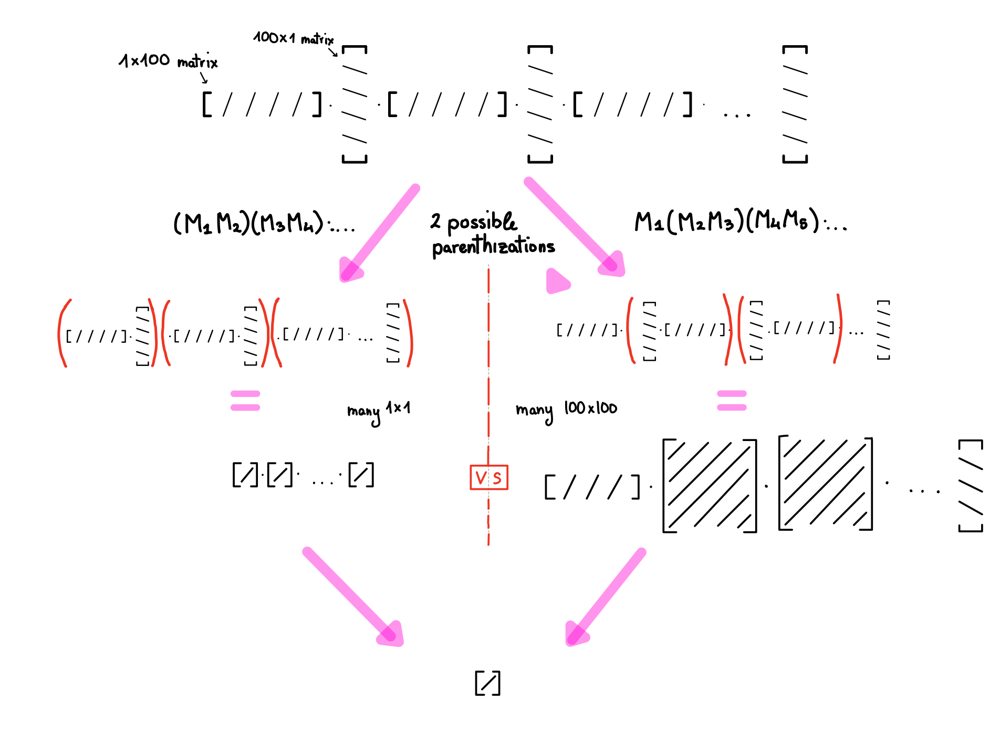
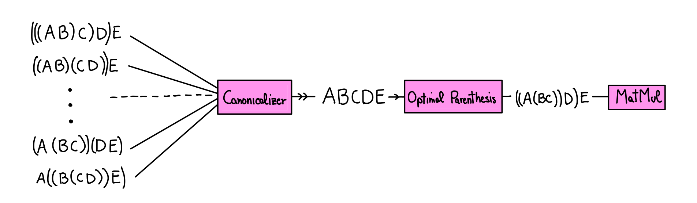

As some of you may know matrix multiplication is associative (a.k.a. all the parenthizations give the same result).
But when you carry out the computation you *have* to choose some order. But associativity makes this irrelevant, right?

Consider:
```python 
Matrix = np.ndarray

@dataclass
class Parenthization:
    left: Parenthization | Matrix
    right: Parenthization | Matrix

def random_matrices(n: int) -> list[Matrix]:
    dims = [random.choice((1, 100)) for _ in range(n + 1)]
    return [np.random.randn(dims[i], dims[i + 1]) for i in range(n)]

def random_parenthization(matrices: list[Matrix]) -> Parenthization | Matrix:
    if len(matrices) == 1:
        return matrices[0]
    k = random.randint(1, len(matrices) - 1)
    left = random_parenthization(matrices[:k])
    right = random_parenthization(matrices[k:])
    return Parenthization(left, right)

def get_product(node: Parenthization | Matrix) -> Matrix:
    if isinstance(node, Matrix):
        return node
    return get_product(node.left) @ get_product(node.right)

if __name__ == '__main__':
    matrices = random_matrices(100)
    parenthizations = [random_parenthization(matrices) for _ in range(1_000)]
    performance_barplot(parenthizations, get_product)

```
> TLDR: For a given product of matrices, generate a bunch of random parenthizations and see how long they take to compute.

Which gives us:
```
   420-   600 ms │ ████
   600-   780 ms │ ██████████████████
   780-   960 ms │ ████████████████████████████
   960-  1130 ms │ ████████████████████████████████████████
  1130-  1310 ms │ █████████████████████████████
  1310-  1490 ms │ ██████████████████████████
  1490-  1670 ms │ ███████████████████
  1670-  1840 ms │ ████████████
  1840-  2020 ms │ ████████████
  2020-  2200 ms │ ██████
  2200-  2380 ms │ ███
  2380-  2550 ms │ ███
  2550-  2730 ms │ ██
  2730-  2910 ms │ █
  2910-  3090 ms │ 
  3090-  3260 ms │ █
```


Holy mother of performance-variance-for-semantically-equivalent-expressions!

---

But why does this happen??


> Different Parenthization => Different Dimensions!
> Multiplying an `X` by `Y` matrix with a `Y` by `Z` matrix takes about `O(XYZ)` scalar ops (XYZ multiplications, X(Y-1)Z additions). So on the LHS each pairwise product takes 1 op, in the RHS about 2 million!

Oh yeah that makes sense! But how do we fix it? Boringly, with some DP:


```python
def optimal_parenthization(matrices: list[Matrix]) -> tuple[int, Parenthization | Matrix]:
    n = len(matrices)
    if n == 1:
        return 0, matrices[0]

    dims = [matrices[0].shape[0]] + [m.shape[1] for m in matrices]
    mult_cost = lambda i, k, j : dims[i] * dims[k + 1] * dims[j + 1]

    @cache
    def solve(i: int, j: int) -> tuple[int, Parenthization | Matrix]:
        if i == j:
            return 0, matrices[i]

        best_cost, best_tree = float("inf"), None

        for k in range(i, j):
            left_cost,  left_tree  = solve(i, k)
            right_cost, right_tree = solve(k + 1, j)

            cost = mult_cost(i, k, j)

            total_cost = left_cost + right_cost + cost
            if total_cost < best_cost:
                best_cost = total_cost
                best_tree = Parenthization(left_tree, right_tree)

        return best_cost, best_tree

    return solve(0, n - 1)
```
> TLDR: To find optimal parenthization: for all the ways to split the list into 2 contiguous chunks, recursively find the cost of the 2 sub-chunks, and add sum them to the cost of doing the top-level multiplication. Then find the minimum value: that is the optimal parenthization!

---

But, ew. Now our code logic is tangled up with implementations details concerning runtimes. How do we address this?

Ideally something like this:



But here's the problem: the matmul is supposed to always be a single matrix (the product of all the matrices up to that point).
But now you are representing it as a tree (of parenthesis)!
Solution: just **collapse** it down to a single matrix when the user "looks" at it! (a.k.a. when the explicit value of the matrix is needed: as long as we keep multiplying, we can just keep building up the list).
So we can do something like this!

```python
@dataclass
class LazyMat:
    matrices: list[Matrix] = field(default_factory=list)

    def __matmul__(self, other: Matrix | LazyMat) -> LazyMat:
        if isinstance(other, Matrix):
            return LazyMat(self.matrices + [other])

        if isinstance(other, LazyMat):
            return LazyMat(self.matrices + other.matrices)
        
        raise NotImplementedError

    def __rmatmul__(self, other: Matrix | LazyMat) -> LazyMat:
        if isinstance(other, Matrix):
            return LazyMat([other] + self.matrices)

        if isinstance(other, LazyMat):
            return LazyMat(other.matrices + self.matrices)
        
        raise NotImplementedError

    def value(self) -> Matrix:
        _, tree = optimal_parenthization(self.matrices)
        prod = get_product(tree)
        self.matrices = [prod]
        return prod

    def __array__(self, dtype=None):
        out = self.value()
        return np.asarray(out, dtype=dtype) if dtype is not None else out
```

So now we passively build up the tree each time we do a matmul, and use `.value()` when we need the matrix itself. Cool!

---

Now for the speedup over eager:

```python

def random_matrices(n: int) -> list[Matrix]:
    dims = [random.randint(10, 1000) for _ in range(n + 1)]
    return [np.random.randn(dims[i], dims[i + 1]) for i in range(n)]

def naive_product(chain):
    """(((A @ B) @ C) @ …)."""
    out = chain[0]
    for m in chain[1:]:
        out = out @ m
    return out

def lazy_product(chain):
    """Wait to evaluate, then do the optimal parenthization"""
    acc = LazyMat()
    for m in chain:
        acc = acc @ m
    return acc.value()

def bench(fn, mats, runs=10):
    t0 = time.perf_counter()
    for _ in tqdm(range(runs)):
        fn(mats)
    return (time.perf_counter() - t0) / runs

if __name__ == "__main__":
    random.seed(0); np.random.seed(0)

    mats = random_matrices(100)

    t_naive = bench(naive_product, mats)
    t_lazy  = bench(lazy_product,  mats)

    print(f"Naïve left‑to‑right : {t_naive*1e3:7.1f} ms")
    print(f"Lazy optimal        : {t_lazy*1e3:7.1f} ms")
    print(f"Speed‑up            : {t_naive/t_lazy:7.1f}×")
```
```
Naïve left‑to‑right :  2298.8 ms
Lazy optimal        :   227.0 ms
Speed‑up            :    10.1×
```

But it doesn't have to end there! We can also act lazily with respect to a whole bunch of over operators. This allows us to do 2 things:
* Right now, each non-matmul operation forces us to compute the entire tree: the more operators we support, the more we can keep the lazy representation!
* More operators => more opportunities for optimizations. E.g. if matrix addition is supported, we can do this: `AB+AC` -> `A(B+C)`!

Stay tuned for part 2...

### Takeaways

* Canonicalization and structured representations are pretty cool I guess?
* With good "compilers" and lazy evaluation, you can separate logic from performance details.


## [[Code]](https://github.com/Marsella8/lazy-matmuls)